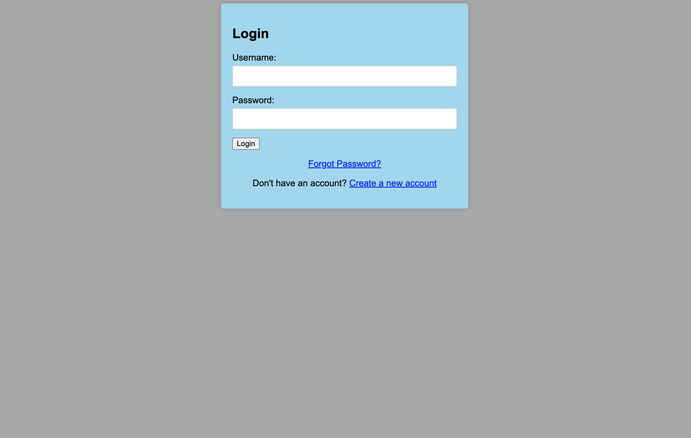

# Weekly Status

## Sprint 1: 2023-09-29 to 2023-10-05

### Billy

#### Project Visualization

### Dylan

Assisted in creation of calory input page
- edited css file for formatting

### Eric

Created rough draft html page.
- page took in simple input and provided simple output

### Jordon

- Combine HTML files
- Separate out CSS and JavaScript
- Write JavaScript for calculating calorie totals and creating new rows for each entry

### Will

##### Progress:

###### Database Design:
- Created an E/R (Entity-Relationship) diagram for the database schema that will serve as the foundation for our food lookup feature.
- The diagram helps to visualize the relationships and connections between various data entities that will be part of the database.

###### Documentation:
- Included a legend with the E/R diagram to ensure clarity in interpretation and understanding of the various symbols and relationships depicted.
- The diagram, along with its legend, has been stored in the `images/sprint_01` directory for reference.

## Sprint 2: 2023-10-06 to 2023-10-12

### Billy - Created Login and HTML pages.

### Dylan

Created user stories for nutrient/calory input page
Created "things to have" table based on user stories
- included input, output, input form type, what will this need columns
- "what will this need" column has loose ideas for what this will entail

### Eric

### Jordon

- Brainstorm structure for storing workout, exercise, and sets information
- Collect list of machine weight lifting exercises

### Will

#### Food Lookup Feature

##### Progress:

###### Initial Setup & Integration with Flask:
- Successfully set up a Flask development framework for the Food Lookup Feature.
- Created a dedicated route for the food tracking page.

###### UI Design & Implementation:
- Designed a basic layout with an input field using `foodlookup.html`.
- Styled the page for a user-friendly experience.

###### Version Control:
- Created a `food_lookup` branch for feature-specific development.

###### Documentation:
- Documented the purpose and features of the `food_lookup.py` in code comments within the python file, to be referenced for later documentation.

##### Next Steps:

###### Set Up MySQL Connection with Flask:
- Establish a MySQL database for the project, which will store foods and their nutritional values.
- Connect the Flask app to this MySQL database using the Flask-MySQL extension.

###### Auto-populate to Relational Database:
- Implement functionality to detect user input in real-time in the food input field.
- Create backend logic to fetch matching food names based on user input and display them as suggestions.

##### Challenges/Blockers:
- The main challenge anticipated for the upcoming week is ensuring a smooth connection between Flask and MySQL, especially considering potential server and database configurations that might need adjustments.
- Constructing the database correctly that can/will be accessed by other team members will require good collaboration on the part of the team.
- Implementing the auto-populate feature requires synchronization between frontend and backend, ensuring efficient and relevant suggestions without overloading the database with frequent queries.

<!-- 
## Sprint X: 2023-MM-DD to 2023-MM-DD

### Billy

### Dylan

### Eric

### Jordon

### Will
-->